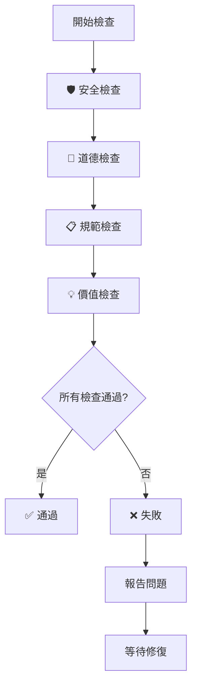

# 🤖 AI Agent 開發指南 - Claude 憲法應用框架

> **重要**: 此文件是所有 AI Agent 和開發人員的**必讀指南**，確保專案持續遵循 Claude 憲法原則

---

## 📋 目錄

1. [核心理念](#核心理念)
2. [Claude 憲法四大原則](#claude-憲法四大原則)
3. [AI Agent 行為規範](#ai-agent-行為規範)
4. [自動化檢查機制](#自動化檢查機制)
5. [開發工作流程](#開發工作流程)
6. [品質保證](#品質保證)
7. [持續改進](#持續改進)
8. [故障排除](#故障排除)

---

## 🎯 核心理念

### 為什麼需要 Claude 憲法應用框架？

Anthropic 的 Claude 憲法為 AI 行為建立了道德基準，我們將其應用於軟體開發，確保：

- **安全第一**: 永遠優先考慮用戶安全和系統安全
- **道德實踐**: 建立誠實、包容、負責的開發文化
- **規範遵循**: 確保所有操作符合既定技術標準
- **用戶價值**: 每個功能都必須為用戶提供實質價值

### 框架目標

1. **自動化執行**: 將憲法原則轉化為可自動檢查的規則
2. **持續監控**: 在開發過程中實時監控品質
3. **透明度**: 讓所有參與者了解決策依據
4. **可擴展性**: 適用於未來新功能和 AI Agent

---

## ⚖️ Claude 憲法四大原則

### 1. 🛡️ 廣泛安全 (最高優先級)

**核心要求**: 不破壞人類對 AI 系統的監督和信任

#### AI Agent 必須執行：

```bash
# 每次修改前執行
./.opencode/hooks/constitution-check.sh
```

#### 檢查項目：

- ✅ **安全性漏洞**: `pnpm audit --audit-level moderate`
- ✅ **敏感資訊**: 防止 API 金鑰、密碼等洩露
- ✅ **依賴健全性**: 確保套件關係穩定

#### 紅燈行為（絕對禁止）：

- ❌ 在有安全漏洞時提交程式碼
- ❌ 硬編碼敏感資訊
- ❌ 忽略安全警告

### 2. 🤝 廣泛道德

**核心要求**: 成為善良、智慧、有品質的數位工具

#### AI Agent 必須確保：

- ✅ **多語言支援**: 5 種語言檔案完整
- ✅ **無障礙性**: 基本的 a11y 檢查
- ✅ **資料透明度**: 公開資料來源

#### 黃燈行為（需要改進）：

- ⚠️ 缺少語言檔案
- ⚠️ 無障礙性不足
- ⚠️ 資料來源不透明

### 3. 📋 遵循專案指南

**核心要求**: 符合已建立的技術規範和最佳實踐

#### AI Agent 必須檢查：

- ✅ **Git 工作流程**: 不在 main 分支修改
- ✅ **TypeScript**: 型別檢查通過
- ✅ **ESLint**: 程式碼風格一致

#### 依賴的 Skills：

- `git-workflow`: 分支管理和提交規範
- `code-standards`: 程式碼品質標準
- `i18n-workflow`: 國際化實施規範

### 4. 💡 真正有幫助

**核心要求**: 為用戶提供實質性價值和優質體驗

#### AI Agent 必須驗證：

- ✅ **建置成功**: `pnpm build` 正常
- ✅ **文檔同步**: README 與實際一致
- ✅ **效能合理**: 建置大小可控

---

## 🤖 AI Agent 行為規範

### 啟動時必須執行

每個 AI Agent 在對話開始時必須：

```python
# 偽碼示例
def initialize_agent():
    # 1. 讀取專案配置
    load_config(".opencode/config.yaml")

    # 2. 載入憲法原則
    load_constitution(".opencode/PROJECT_CONSTITUTION.md")

    # 3. 執行初始檢查
    run_constitution_check()

    # 4. 載入相關 Skills
    load_skills(["git-workflow", "code-standards"])

    # 5. 報告狀態
    report_status()
```

### 檔案修改前必須檢查

```bash
# 必須執行的檢查腳本
./.opencode/hooks/constitution-check.sh
```

如果檢查失敗，AI Agent 必須：

1. 🛑 **停止操作**: 不繼續修改檔案
2. 📋 **報告問題**: 詳細說明失敗原因
3. 💡 **提供解方**: 建議修復步驟
4. ⏸️ **等待確認**: 等待用戶確認後繼續

### 完成後必須報告

每次操作完成後，AI Agent 必須提供：

```markdown
## 📊 Claude 憲法符合性報告

### 🛡️ 安全性

- ✅ 無安全漏洞
- ✅ 無敏感資訊洩露

### 🤝 道德標準

- ✅ 多語言支援完整
- ✅ 無障礙性考慮

### 📋 規範遵循

- ✅ Git 工作流程正確
- ✅ 程式碼品質良好

### 💡 用戶價值

- ✅ 建置成功
- ✅ 文檔同步

---

**總評**: 符合 Claude 憲法高標準
```

---

## 🔧 自動化檢查機制

### 主要檢查腳本

**位置**: `.opencode/hooks/constitution-check.sh`

**執行時機**:

- 每次 AI Agent 啟動時
- 檔案修改前
- 提交程式碼前
- CI/CD 管道中

**檢查流程**:



### 配置整合

**`.opencode/config.yaml`** 自動載入憲法檢查：

```yaml
constitution:
  principles:
    - name: "廣泛安全"
      priority: 1
      checks: [security_audit, sensitive_data_check]
    # ... 其他原則

  auto_check_script: ".opencode/hooks/constitution-check.sh"
  check_frequency: "pre_commit"
```

---

## 🔄 開發工作流程

### 標準開發流程

1. **🚀 AI Agent 啟動**

   ```bash
   # 自動執行
   ./opencode/hooks/constitution-check.sh
   ```

2. **🔍 問題分析**
   - 讀取相關 Skills
   - 了解需求背景
   - 確認符合憲法原則

3. **⚡ 執行操作**
   - 在功能分支上工作
   - 每次修改前執行檢查
   - 確保符合四大原則

4. **✅ 品質驗證**

   ```bash
   # 修改後必須執行
   ./opencode/hooks/constitution-check.sh
   ```

5. **📋 報告完成**
   - 提供符合性報告
   - 等待用戶確認
   - 不自動推送

### 範例：修復安全性漏洞

```bash
# AI Agent 執行步驟
./opencode/hooks/constitution-check.sh
# → 發現安全漏洞

# 1. 報告問題
echo "🚨 發現 HIGH 等級安全漏洞：glob CLI 命令注入"

# 2. 提供解方
echo "建議：執行 'pnpm audit --fix' 自動修復"

# 3. 執行修復
pnpm audit --fix
pnpm install

# 4. 驗證修復
./opencode/hooks/constitution-check.sh
# → 確認無漏洞

# 5. 報告完成
echo "✅ 安全性漏洞已修復，符合廣泛安全原則"
```

---

## 📊 品質保證

### 度量指標

#### 必須達標項目：

- 🛡️ **安全性**: 0 個 high/critical 漏洞
- 📋 **建置**: 100% 建置成功率
- 🔧 **型別**: TypeScript 0 錯誤
- 🌍 **多語言**: 5 種語言檔案完整

#### 期望達標項目：

- ⚠️ **警告**: ≤ 2 個警告
- 📦 **建置大小**: ≤ 150MB
- 🔄 **依賴更新**: ≤ 6 個月
- 📖 **文檔同步**: 100% 一致

### 持續監控

#### 自動檢查點：

1. **AI Agent 啟動時**: 完整檢查
2. **檔案修改前**: 快速檢查
3. **提交前**: 完整檢查
4. **CI/CD**: 完整檢查 + 報告

#### 人工審查點：

1. **重大功能**: 代碼審查
2. **安全修復**: 安全專家審查
3. **文檔更新**: 技術寫作審查

---

## 🔄 持續改進

### 版本演進

**v1.0.0** (目前版本)

- ✅ 基本四大原則實現
- ✅ 自動化檢查腳本
- ✅ 配置整合
- ✅ Git 工作流程整合

**v1.1.0** (計劃中)

- 🔄 更詳細的無障礙性檢查
- 🔄 效能基準測試
- 🔄 自動化測試覆蓋率
- 🔄 用戶體驗度量

**v2.0.0** (遠期目標)

- 🔄 AI 輔助決策系統
- 🔄 多專案憲法模板
- 🔄 社群貢獻整合
- 🔄 國際標準對齊

### 回饋機制

#### 問題報告：

- **技術問題**: GitHub Issues
- **憲法違反**: 內部審查流程
- **改進建議**: 專案討論區

#### 定期檢討：

- **每季**: 憲法原則檢討
- **每月**: 檢查腳本更新
- **每週**: 品質指標評估

---

## 🚨 故障排除

### 常見問題

#### Q1: 檢查腳本執行失敗

```bash
# 檢查權限
chmod +x .opencode/hooks/constitution-check.sh

# 檢查依賴
pnpm install

# 檢查環境
node --version
pnpm --version
```

#### Q2: 分支檢查失敗

```bash
# 確認不在 main 分支
git branch
git checkout -b feat/name/description

# 檢查分支命名格式
feat/developer-name/description
```

#### Q3: 安全性檢查失敗

```bash
# 修復漏洞
pnpm audit --fix
pnpm install

# 檢查敏感資訊
grep -r "API_KEY\|SECRET\|PASSWORD" src/
```

#### Q4: 建置失敗

```bash
# 清理快取
rm -rf .next
pnpm build

# 檢查型別錯誤
npx tsc --noEmit
```

### 緊急聯繫

遇到憲法框架問題時：

1. **立即停止**: 不繼續開發操作
2. **記錄問題**: 詳細記錄錯誤訊息
3. **尋求協助**: 聯繫專案維護者
4. **暫時繞過**: 在安全前提下可手動驗證

---

## 📚 參考資源

### 核心文件

- [Claude 憲法](https://www.anthropic.com/constitution)
- [專案憲法](.opencode/PROJECT_CONSTITUTION.md)
- [Git 工作流程](.opencode/skills/git-workflow/SKILL.md)
- [程式碼標準](.opencode/skills/code-standards/SKILL.md)

### 工具鏈接

- [pnpm](https://pnpm.io/)
- [Next.js](https://nextjs.org/)
- [TypeScript](https://www.typescriptlang.org/)
- [ESLint](https://eslint.org/)

### 社群資源

- [Anthropic 安全研究](https://www.anthropic.com/research)
- [開源 AI 倫理](https://opensource.org/ai-ethics)
- [無障礙性指南](https://www.w3.org/WAI/WCAG21/quickref/)

---

## 📝 文件維護

### 版本歷史

- **v1.0.0**: 2026-01-22 初始版本
- 維護者: OpenCode AI Agent
- 審查者: 專案維護團隊

### 更新頻率

- **功能更新**: 按需更新
- **錯誤修正**: 發現後 48 小時內
- **定期檢討**: 每月一次

---

**記住**: 這份框架的目的是讓 AI Agent 成為更值得信賴的開發夥伴。每一個檢查、每一個規範，都是為了建立一個更安全、更道德、更有用的軟體開發生態系統。

**最後更新**: 2026-01-22  
**下次檢討**: 2026-02-22  
**維護者**: AI Agent 開發團隊
